## PYPI:[https://pypi.org/project/phlsM3U8-downner/](https://pypi.org/project/phlsM3U8-downner/)

## phlsM3U8_downner

支持 AES-128 解密与 ffmpeg 合并的异步 HLS/m3u8 下载工具。

支持主播放列表清晰度选择、分片并发下载、AES-128 解密，以及通过 ffmpeg 无损合并。

## 安装
    pip install phlsM3U8_downner

## 更新包
    pip install --upgrade phlsM3U8_downner
————————————————————————————————————————————————

需系统 PATH 环境变量中包含 **ffmpeg**：
Windows：`winget install ffmpeg` · macOS：`brew install ffmpeg` · Linux：`sudo apt install ffmpeg`

## Usage

# import phlsM3U8_downner

**或者**

# from phlsM3U8_downner import * #导入全部函数

#此处示例使用 `import phlsM3U8_downner` 写法

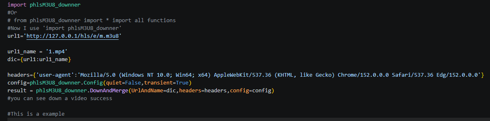

# 视频下载成功效果示例：

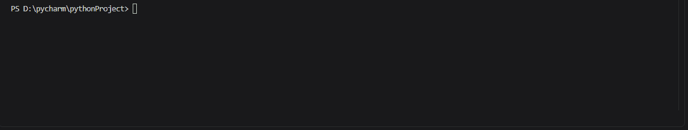

# 以上是一个最简使用示例

## More Usage

- Config：
    Config 中包含大量配置项，详见下文：
       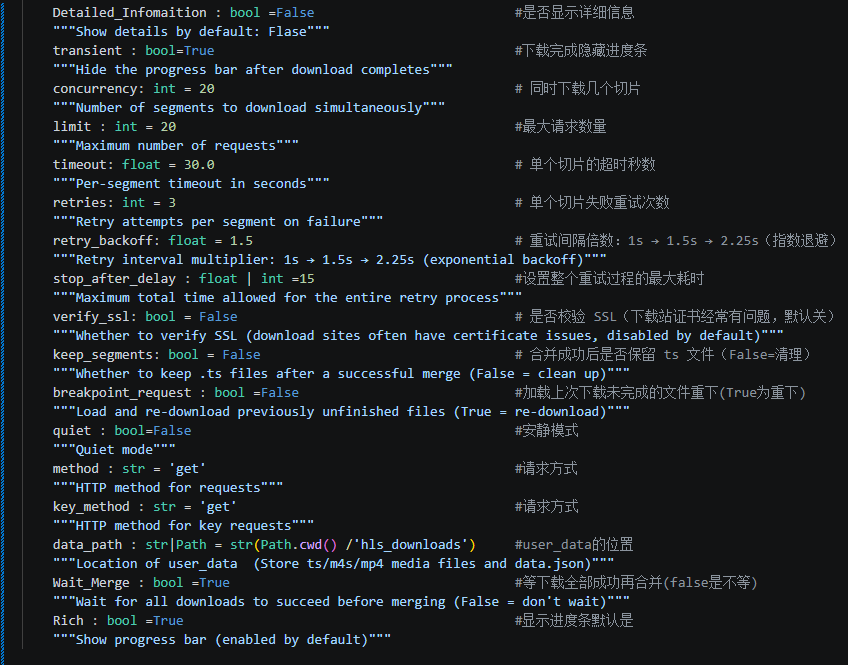
    - 如何使用 Config？
       
##`Config` 注意事项：

        - 若要启用 breakpoint_request 功能，data.json 中的失败分片（failed_segments 和 key_errors）不能为空数组，否则该功能不会生效
        - 文件下载完成后，data.json 会自动刷新；注意 **phlsM3U8_downner 会覆盖文件已有内容**
        - 若将 quiet 设为 True，大部分控制台输出都会被关闭 —— 进度条也不会显示
        - key_method /method：method 是普通分片（segment）文件的请求模式，key_method 是专门用于密钥请求的模式；在部分场景下该区分很有用。你可以将二者统一设为 **'get'**
        - Wait_Merge：若设为 True，会忽略 data.json 中的失败分片，直接合并已成功下载的分片，这可能导致合并后的视频缺少部分片段
        
    ## resolver：
        - 在 defined_decode 中，**defined_method** 用于自定义加密方案，但 phlsM3U8_downner 可能不支持这类方案（目前仅支持 AES-128 加密，已可满足绝大多数场景）
        - 你可以通过 **defined_func** 参数传入自定义解密函数，格式为 **{key_url: function_name}**，phlsM3U8_downner 会调用你的函数执行解密
        - 如果获取到的密钥本身是加密的，可以使用 encrypto_key **{key_url: function_name}** 来解密密钥
        - 如果 phlsM3U8_downner 无法获取密钥（例如 DRM 场景），可以使用 **defined_key** 直接传入你已获取的密钥（字节类型）。如果使用 **defined_key**，请务必同时通过 **defined_iv** 传入 **{key_url: iv}**。尽管 phlsM3U8_downner 内置了兜底逻辑，会使用分片序号自动生成 iv，但该设置能提供额外保障
        （resolver.defined_method 方法解析器、resolver.defined_func 自定义函数、resolver.encrypto_key 密钥解密、resolver.defined_iv 自定义初始向量、resolver.defined_key 自定义密钥）
- 怎么用?举个例子:
  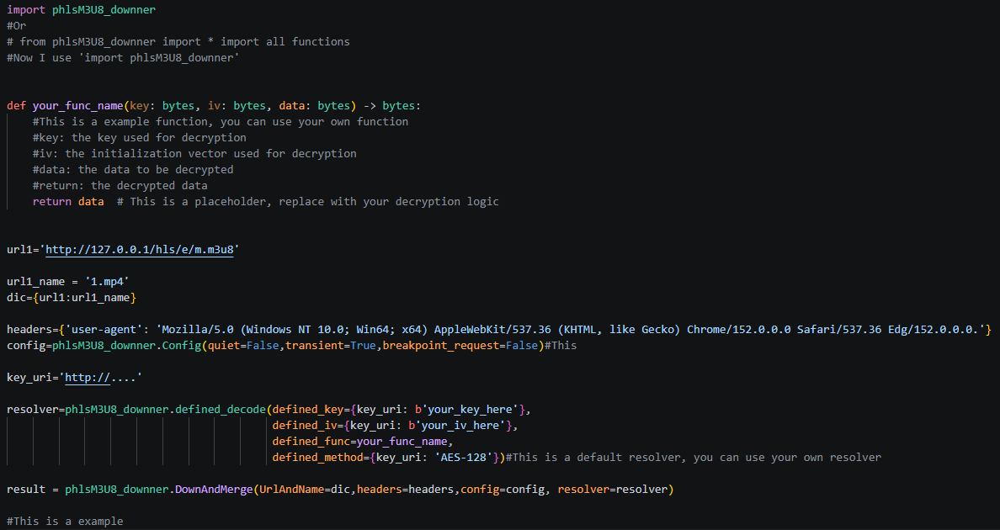
- 每一个key_uri对应一个值，用字典传，传好后直接运行程序程序会用key_uri为键优先寻找resolver中的值

## 使用DownAndMerge后返回的值有什么用?
 - 他会返回一个字典,以名字为键,可以拿到一个对象,对象含有以下值:
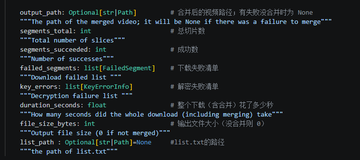
- result['your file name'].xxx可以获得特定的值

## Notes

- 不要同时给多个下载任务设置相同的输出文件名（后启动的任务会覆盖先完成的文件）
- 同时下载多个主播放列表时，必须手动选择清晰度 —— 建议逐个下载
- 完整配置项可查看 `Config`（在 IDE 中悬停即可查看所有字段）

##data.json
-data.json 默认生成路径为 hls_downloads\data.json
- 如果需要修改存储目录，比如出现目录重复的场景，只需修改配置中 data_path 的值即可

- 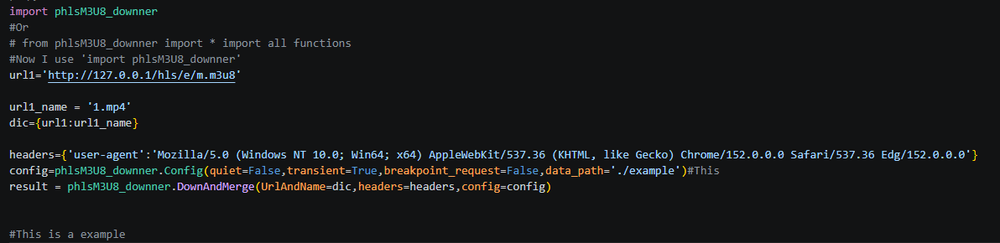

- 程序启动后，会在示例文件夹中生成 data.json，注意原 data.json 中的数据不会被复制到新的 data.json 文件中

     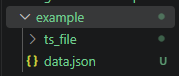

##breadkpoint_requese of config
    - 有时会出现如下下载失败的情况
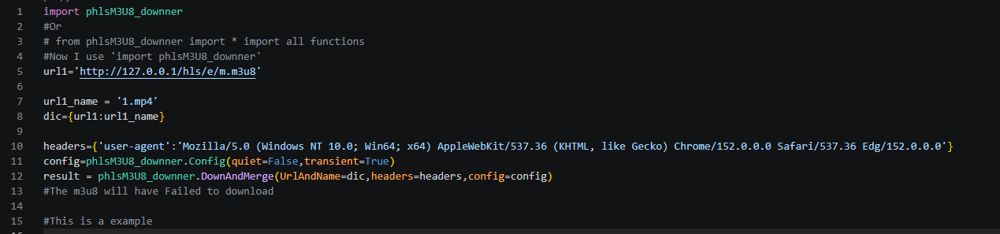
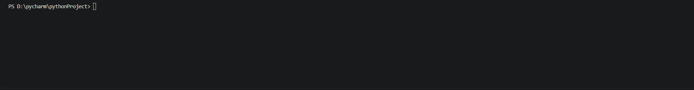
    - 此时 data.json 文件会显示如下内容
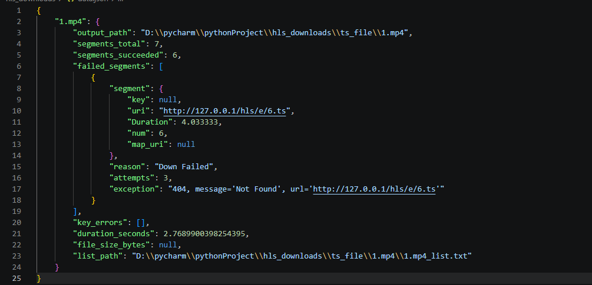
    - 如果 key_error 或 FailedSegments 不为空
    - 你可以将 breakpoint_request 设为 True
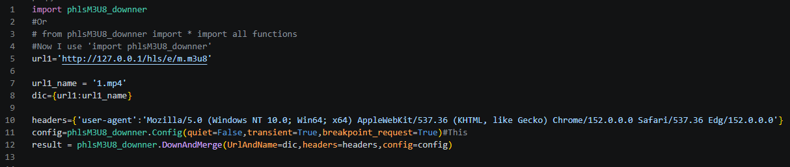
    - 再次运行程序时，会自动读取 data.json 中的失败分片，重新下载并合并
    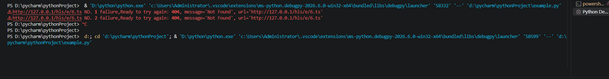
    - 同时，data.json 中对应的失败记录会被清空
## 更新日志
    ## 0.1.5修复了一个bug

    ## 0.1.4 Update the Detailed_Information property in the config to show detailed retry report info

    ## 0.1.3 优化
    
    ## 0.1.2 无更新说明
    
    ## 0.1.1 日志由中文改为英文

    ## 0.1.0 首次发布

  
